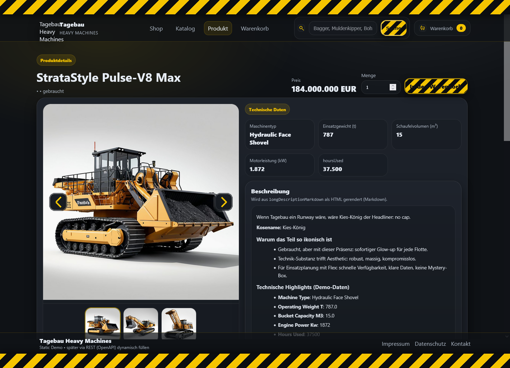

# Tagebau Webshop: Gebrauchte Großmaschinen

## Überblick

Der **Tagebau Webshop** ist ein experimentelles Demo-Projekt auf Basis
von **Spring Boot**, das als ***persönliche Versuchsküche*** für moderne
Backend-Architekturen, Contract-First-API-Design und KI-unterstütztes
Programmieren dient.

Status:  ***"Work in Progress."***

Ziel ist die schrittweise Entwicklung eines realitätsnahen Shop-Systems
unter Einsatz moderner Methoden, Code-Generierung und KI-unterstützter
Implementierung.

------------------------------------------------------------------------

## Live-Demo

### 👉 http://tagebau.3dc.de

------------------------------------------------------------------------

## Screenshot

------------------------------------------------------------------------

## Projektziel

Dieses Projekt demonstriert:

-   Contract-First-Entwicklung mit OpenAPI 3.x (YAML)
-   API-Driven Design
-   Generierung von Spring Boot Server-Stubs
-   KI-gestützte Client-Generierung („VibeCoding")
-   KI-unterstützte Backend-Implementierung
-   KI-generiertes Datenbankmodell inkl. ORM-Anbindung
-   Iterative, lernorientierte Erweiterung des Systems

------------------------------------------------------------------------

## Architektur

### Contract-First Ansatz

Die API wird zuerst als OpenAPI-Spezifikation definiert.\
Die YAML-Dateien bilden die zentrale Quelle für:

-   Server-Stubs
-   API-Dokumentation
-   Validierung
-   Client-Generierung

Dadurch wird eine klare Trennung zwischen Schnittstelle und
Implementierung erreicht.

------------------------------------------------------------------------

### Backend (Spring Boot)

-   Generierte Controller- und Model-Stubs auf Basis der
    OpenAPI-Definition
-   Manuelle Implementierung der Geschäftslogik mit gezielter
    KI-Unterstützung
-   Einsatz von JPA / Hibernate
-   Validierung, Exception-Handling und saubere Schichtenarchitektur

Die KI wird unterstützend eingesetzt für: - Refactoring -
Architektur-Diskussion - Testfall-Generierung - Performance-Optimierung

------------------------------------------------------------------------

### Datenbankmodell

Das relationale Datenbankmodell wurde initial KI-generiert und
anschließend validiert und angepasst.

Enthalten sind: - Entitäten - Relationen - Constraints - ORM-Mappings

------------------------------------------------------------------------

### Client -- VibeCoding

Der Client wird nahezu vollständig KI-generiert auf Basis der
OpenAPI-Spezifikation.

Vorgehen: 1. OpenAPI als Single Source of Truth 2. Generierung des
API-Clients 3. KI-gestützte Erstellung von UI-Komponenten 4. Iterative
Optimierung

------------------------------------------------------------------------

## Methodische Schlagworte

-   Contract-First Development
-   OpenAPI 3
-   Code Generation
-   Spring Boot
-   RESTful Architecture
-   Domain Modeling
-   AI-Augmented Programming
-   Human-in-the-Loop Development
-   Separation of Concerns
-   Iterative Architekturentwicklung

------------------------------------------------------------------------

## Für HR / technische Entscheider

Dieses Projekt zeigt:

-   Strukturiertes API-Design
-   Professionellen Einsatz von OpenAPI
-   Moderne Spring-Boot-Architektur
-   Reflektierten Umgang mit KI-gestützter Entwicklung
-   Kombination aus Code-Generierung und manueller Qualitätssicherung

------------------------------------------------------------------------

## Zusammenfassung

Der Tagebau-Webshop ist eine kontinuierlich wachsende Referenzanwendung,
die Contract-First-Design, Spring Boot und KI-unterstützte
Softwareentwicklung in einem realistischen Projektrahmen kombiniert.
